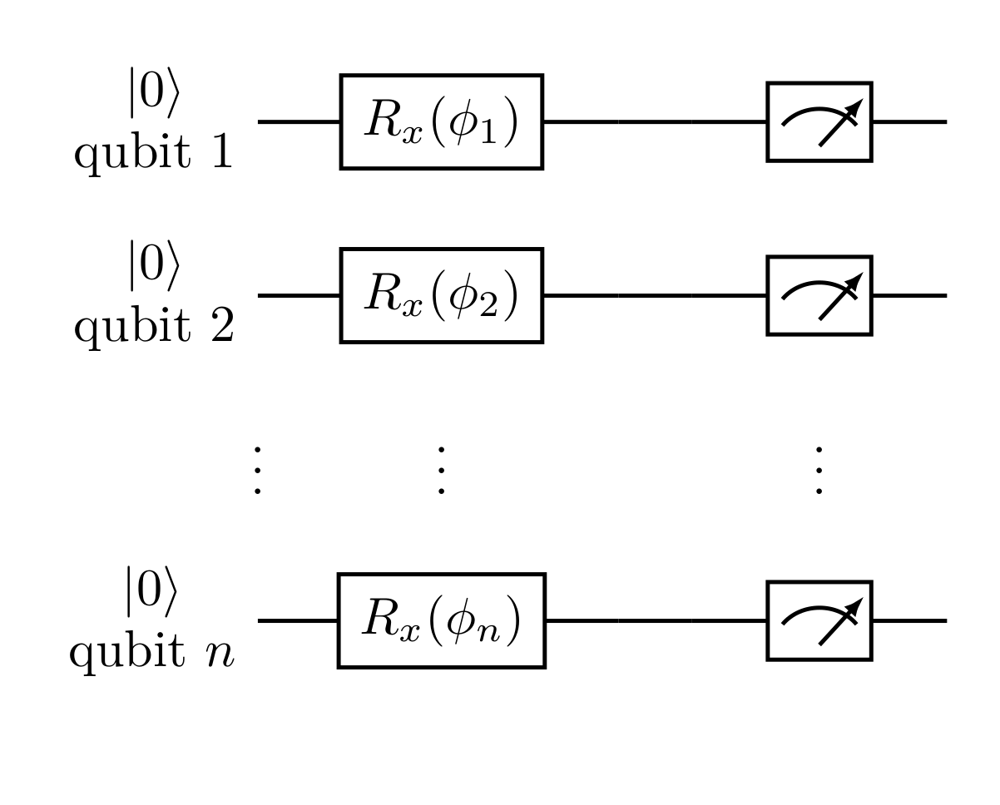
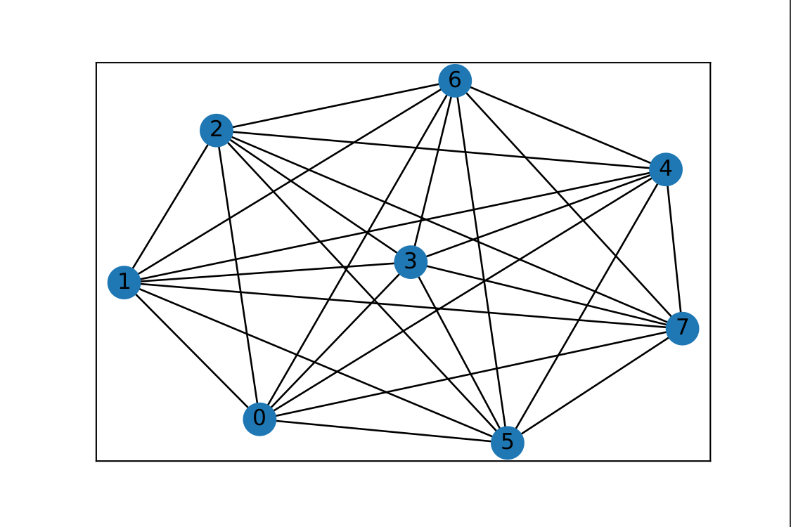
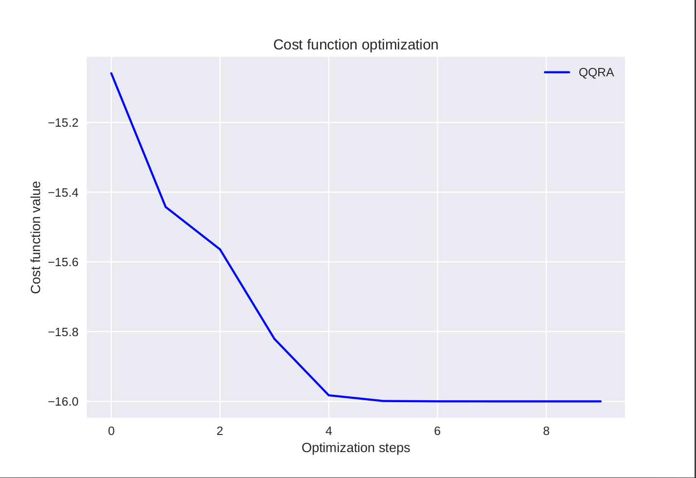
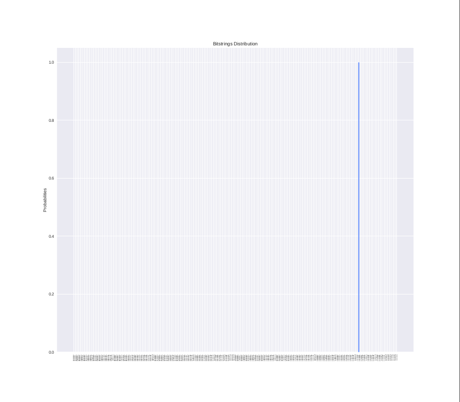
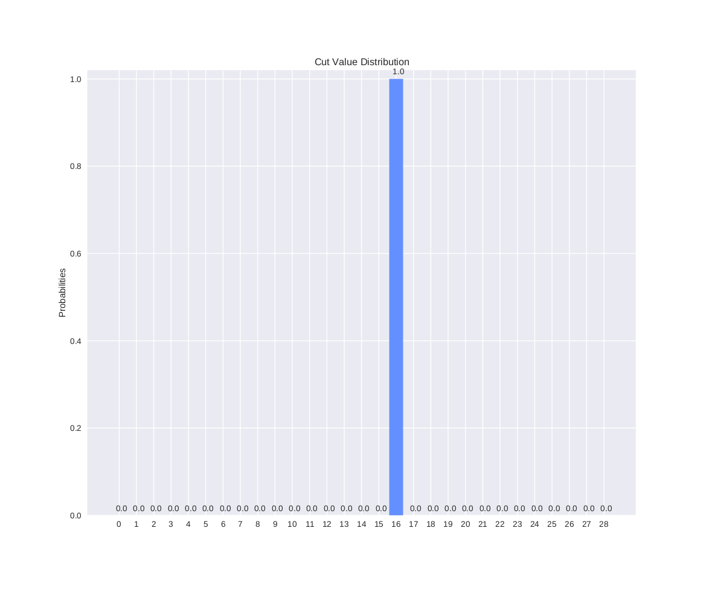

# Quantum Qubit Rotation Algorithm

## Single qubit rotation gates

$$
U(\Theta)=\bigotimes_{i=1}^n R_x (\phi_i)
$$

## QQRA for the max-cut problem 

This code was tested on an Ubuntu 20.04 system using [pennylane 0.14.1](https://pennylane.ai/).

### Graph

You can use other graphs as a test. I choose an $8$-vertex complete graph for testing, this graph is generated by [networkx](https://networkx.org/).

### Loss

The loss function is the opposite of the cut value of the graph 

### Distribution

The distribution of bit string:

### Result:

The maximum cut value of $8$-vertex  $|C| = 16$.

The solution of the max-cut problem can be obtained with probability close to $1$.

